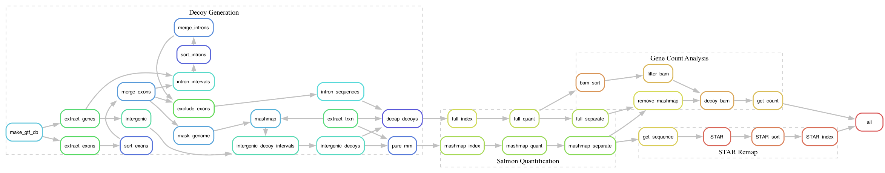

# Splicing Dysregulation Pipeline
[](https://opensource.org/licenses/MIT)

**Author:** Xiaoqing Zheng  
**Affiliation:** Department of Biological Sciences, National University of Singapore  
**Supervisor:** Prof. Greg Tucker-Kellogg

## 🗺️ Overview

This repository contains a modular computational pipeline for detecting cryptic and non-canonical splicing dysregulation from RNA-seq data. It repurposes decoy-aware alignment signals—traditionally discarded as transcriptional noise—as a novel source of splicing insights.


The pipeline consists of three major stages:
1. **Decoy generation** — building intergenic and intronic decoys from a reference genome.
2. **Salmon Quantification** — using Salmon for selective alignment and extracting decoy-mapped reads.
3. **Gene Count Analysis** — filtering and quantifying decoy-mapped reads to identify significant intronic enrichment at the gene level.
4. **Re-alignment & Visualization** — validating signal using STAR, and visualizing with custom R and Shiny scripts.

Originally developed and benchmarked using a TDP-43 knockout mouse model, the pipeline identifies differential intronic signal associated with disease conditions, offering an annotation-agnostic strategy for transcriptome analysis.

## 🔬 Key Features
- 🧬 **Decoy Sequence Design**: Generates intergenic and intronic decoys to trap transcriptional noise
- ⚙️ **Selective Alignment with Salmon**: Isolates decoy-mapped reads for downstream analysis
- 📉 **Differential Analysis**: Detects enriched intronic signals using DESeq2
- 🧠 **Splice Junction Validation**: STAR-based realignment to confirm non-canonical junctions
- 🧰 **Modular Snakemake Workflow**: Easily configurable and extendable

## 📁 Project Structure

```
.
├── docs/                  # Documentation and scheme diagram
├── results/               # Sample output plots and supplementary PDFs
├── src/                   # All source code (Python, R, Shell, Snakemake)
│   ├── scripts/           # Shell scripts and analysis helpers
│   ├── snakemake_Master/  # Core workflow and subworkflows
│   ├── visual_shiny/      # Shiny-based visualizations
│   └── further/, .qmd/.r  # Supplementary scripts and Quarto/R documents
└── test_data/             # Example input test files
```

## 🛠️ Installation & Requirements

All dependencies are managed through `conda`. A basic installation includes:
- Python 3.10+
- Snakemake
- R and required packages (`shiny`, `Gviz`, `rtracklayer`, `DESeq2`, etc.)

## 🚀 Usage

1. **Prepare Input and Set Directory:**
   - Place RNA-seq FASTQ files under the one directory.
   - Update `config/samples.tsv` with your sample metadata.
   - Manually update all relevant `config.yaml` files under:
     - `src/snakemake_Master/config.yaml`
     - `src/snakemake_Master/subworkflows/snakemake_dataprocess/config/config.yaml`
     - `src/snakemake_Master/subworkflows/snakemake_decoygenerate/config/config.yaml`
   - Ensure that all file paths (e.g., GTF file, genome FASTA, STAR genome index, chromosome size) and output directories reflect your system setup.
   - These changes must be consistent across subworkflows to ensure smooth execution.
 to reflect your local input/output directories, genome references, or desired pipeline behavior
     - Ensure consistency across different steps
     - If necessary, edit file paths for genome FASTA, GTF annotation, or output destinations

2. **Run Pipeline:**
```bash
snakemake --cores 8 --use-conda
```

3. **View Output:**
   - Intermediate quantification: `results/`
   - Visualization and plots: `src/visual_shiny/`

## 📊 Example Output

The following outputs can be generated using specific scripts in the repository:

- **Volcano Plot of Intronic Enrichment**  
  → See: `src/scripts/tsv.r`

- **STAR-based Splice Junction Visualization**  
  → See: `src/visual_shiny/dependent_2.R` or `src/visual_shiny/shiny_vis.R`

- **GO Term Enrichment Analysis**  
  → See: `src/scripts/GO.R`
  
## 📚 Detailed Manual Execution

For advanced users or developers who want to run individual steps outside the Snakemake workflow, please refer to [`docs/Detail_explanation.md`](docs/Detail_explanation.md) for a breakdown of the key stages, including input/output expectations and script-specific notes.

## 🙏 Acknowledgements

This work was completed under the supervision of **Prof. Greg Tucker-Kellogg** as part of the MSc Biotechnology Capstone Project at the National University of Singapore.

## 📬 Contact
For questions or collaboration inquiries:
Xiaoqing Zheng [e1124735@u.nus.edu]; Greg Tucker-Kellogg [dbsgtk@nus.edu.sg]
