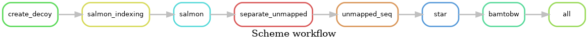

# Waiting for more appropriate title

## Description

Utilize the special function from Salmon for less computation complex alternative splicing events detection. (?)

## Workflow

**Optional: Set up**

The workflow has dependences: seqtk, etc. (wait for append)
```bash
git clone https://github.com/lh3/seqtk.git
cd seqtk
make
```

### 1. Start with Salmon Selective Alignment

#### a. Create Decoy and Build Salmon Index

We adapted the default [decoy sequence generation process](https://github.com/COMBINE-lab/SalmonTools/blob/master/scripts/generateDecoyTranscriptome.sh) (`src/generateDecoyTranscriptome.sh`) to include intronic regions, where potential alternative splicing events may occur.  

The Salmon index building step is executed using a separate shell script (`salmon-index.sh`) to clearly separate workflow steps.

Note: Refer to the script documentation for detailed instructions on setup, required inputs, and expected outputs.

#### b. Run Salmon Selective Alignment

This step uses Salmon in selective alignment mode to process RNA-seq reads and identify unmapped regions where abnormal splicing events may occur. The script `src/salmon.sh` handles this step, producing:  
- A quantification file.  
- A supplementary file `unmapped_names.txt`, containing sequence IDs for decoy alignments, partial alignments, and unmapped sequences.  

Note: Refer to the `src/salmon.sh` script documentation for detailed instructions on setup, required inputs, and expected outputs.

#### c. Extract Unmapped sequence

This step processes unmapped sequences identified by Salmon Selective Alignment mode using the following scripts:

- `src/separate_unmapped.sh`: Groups sequences tagged as `d`, `m1`, `m2`, and `u` into separate `.lst` files.

- `src/filter_fastq.sh`: Utilizes [seqtk](https://github.com/lh3/seqtk) to extract sequences based on the unmapped names.

Note: Refer to the script documentation for detailed instructions on setup, required inputs, and expected outputs.

### 2. Map Reads with STAR Alignment

The `src/star.sh` script uses the STAR aligner to map unmapped reads, producing a sorted BAM file and separate files based on read groups or unmapped tags.

Note: 
- Refer to the script documentation for detailed instructions on setup, required inputs, and expected outputs.
- The STAR index used in this current project is part of previous project `STAR_v2.7.9a_index_mmusculus_gencode.vM29`, generated using GENCODE Primary assembly GRCm39 mouse FASTA (GRCm39.primary_assembly.genome.fa)

### 3. Visualization Mapping result with GViz

The `src/visualization_bw.qmd` file provides a Quarto document for visualizing mapping results using the GViz package in R. This step generates genome-level visualizations to better interpret the alignment and mapping data from the previous steps.
- `src/visualization_bw.r`: Extracted core R script for generating plots. Use `source("src/visualization_bw.r")` to run directly.
  - Generates PDFs:
    1. Standard plot `plot_gene("GENE_NAME")`: [GENE_NAME.pdf](../results/Ppp6c.pdf)
    2. Supplemental plot `plot_supplymental("GENE_NAME")`: [GENE_NAME_supplemental.pdf](../results/Ppp6c_supplymental.pdf)

Note:
- Need a Quarto-compatible environment to open the file.
- Ensure that the necessary R libraries (e.g., GViz, GenomicRanges) are installed before running the visualization.
- Customize parameters (e.g., file paths, regions) as needed.

## Contact
Author: Zheng Xiaoqing  
Email: e1124735@u.nus.edu  
Mentor: Greg Tucker-Kellogg  
Email: dbsgtk@nus.edu.sg  
